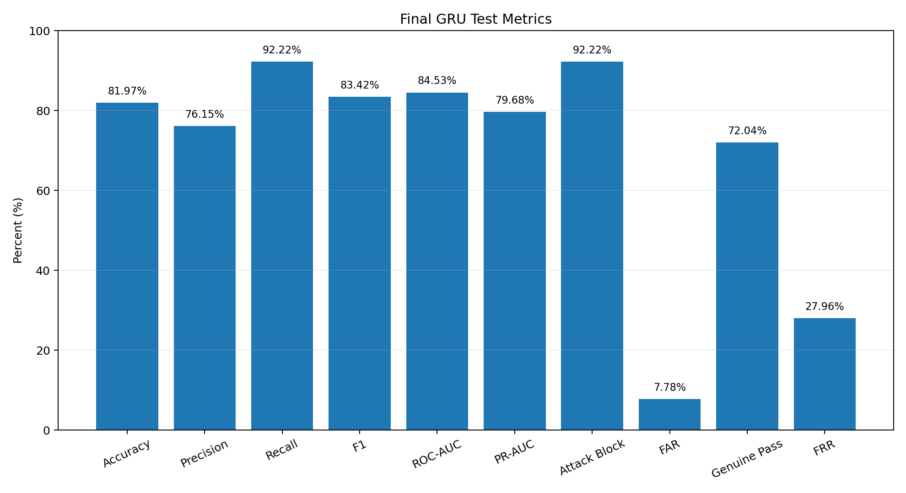
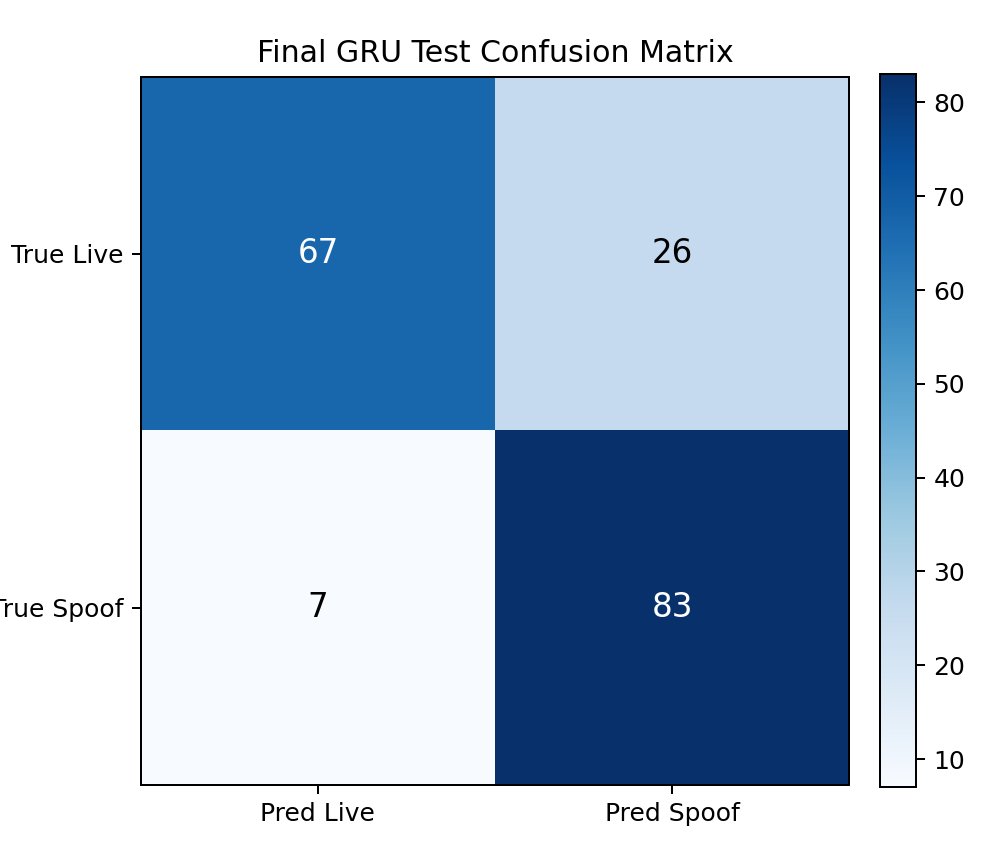

# Model Performance Metrics

Final selected model performance report for `runs/gru_h32_lr0005_v1`.

## Model

```text
Dataset: face_clip_data.npz
Model: GRU sequence classifier
Run: runs/gru_h32_lr0005_v1
Checkpoint: best_gru.pt
ONNX: best_gru.onnx
Threshold: 0.21
Feature mode: all
Selected feature count: 20
Parameter count: 5217
Input shape: (16, 20) per sample
Label: live=0, spoof=1
```

## Overall Metrics

| Split | n | Accuracy | F1 Spoof | ROC-AUC | PR-AUC | Attack Block | Attack Pass / FAR | Genuine Pass | FRR | Confusion Matrix |
|---|---:|---:|---:|---:|---:|---:|---:|---:|---:|---|
| valid | 169 | 81.07% | 83.33% | 88.43% | 87.32% | 94.12% | 5.88% | 67.86% | 32.14% | TN=57, FP=27, FN=5, TP=80 |
| test | 183 | 81.97% | 83.42% | 84.53% | 79.68% | 92.22% | 7.78% | 72.04% | 27.96% | TN=67, FP=26, FN=7, TP=83 |

## Test Metrics by Attack Type

| Attack Type | n | Accuracy | Recall / Block Rate | Attack Pass / FAR | F1 Spoof | Confusion Matrix |
|---|---:|---:|---:|---:|---:|---|
| live | 93 | 72.04% |  |  | 0.00% | TN=67, FP=26, FN=0, TP=0 |
| print | 28 | 92.86% | 92.86% | 7.14% | 96.30% | TN=0, FP=0, FN=2, TP=26 |
| replay | 62 | 91.94% | 91.94% | 8.06% | 95.80% | TN=0, FP=0, FN=5, TP=57 |

## Test Metrics by Source Group

| Source Group | n | Accuracy | Attack Block | Attack Pass / FAR | Genuine Pass | FRR | F1 Spoof | Confusion Matrix |
|---|---:|---:|---:|---:|---:|---:|---:|---|
| ATK_external_clip | 32 | 93.75% | 93.75% | 6.25% |  |  | 96.77% | TN=0, FP=0, FN=2, TP=30 |
| R_live_clip | 21 | 4.76% |  |  | 4.76% | 95.24% | 0.00% | TN=1, FP=20, FN=0, TP=0 |
| S_dataset_sequence | 130 | 91.54% | 91.38% | 8.62% | 91.67% | 8.33% | 90.60% | TN=66, FP=6, FN=5, TP=53 |

## Presentation Benchmark

For presentation, `R_live_clip` is treated as a separate stress test because it was collected differently from the main benchmark sources.

| Benchmark | Included Sources | n | Accuracy | F1 Spoof | Attack Block | Attack Pass / FAR | Genuine Pass | FRR | Confusion Matrix |
|---|---|---:|---:|---:|---:|---:|---:|---:|---|
| Main Benchmark | S_dataset_sequence, ATK_external_clip | 162 | 91.98% | 92.74% | 92.22% | 7.78% | 91.67% | 8.33% | TN=66, FP=6, FN=7, TP=83 |
| R_live Stress Test | R_live_clip | 21 | 4.76% | 0.00% | 0.00% | 0.00% | 4.76% | 95.24% | TN=1, FP=20, FN=0, TP=0 |

## Visualization Files

Generated performance visualizations are stored under `docs/performance/`.






CSV summaries:

```text
docs/performance/overall_metrics.csv
docs/performance/group_metrics.csv
docs/performance/presentation_benchmark_metrics.csv
```

Note: ROC-AUC and PR-AUC scalar values are available in the metrics. Full ROC/PR curves require per-sample prediction scores, which are not stored in the current aggregate CSV artifacts.

## Interpretation

- The final model performs well on the main benchmark sources, with high attack blocking and low attack pass rate.
- `R_live_clip` has a high false reject rate, so the final CAPTCHA should not use face liveness as a standalone decision.
- The deployed CAPTCHA combines `spoof_score` with face/hand mission success over three rounds in `src/captcha_decision.py`.

## Source Files

These metrics were generated from local artifact files that are intentionally not committed to git:

```text
runs/gru_h32_lr0005_v1/model_results.csv
runs/gru_h32_lr0005_v1/group_results.csv
```
